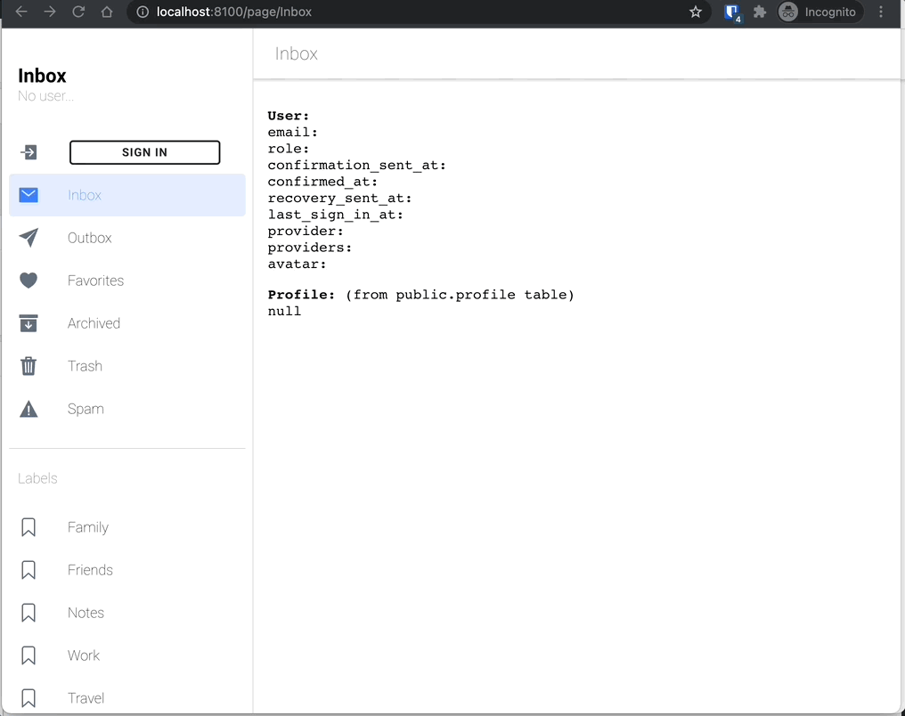
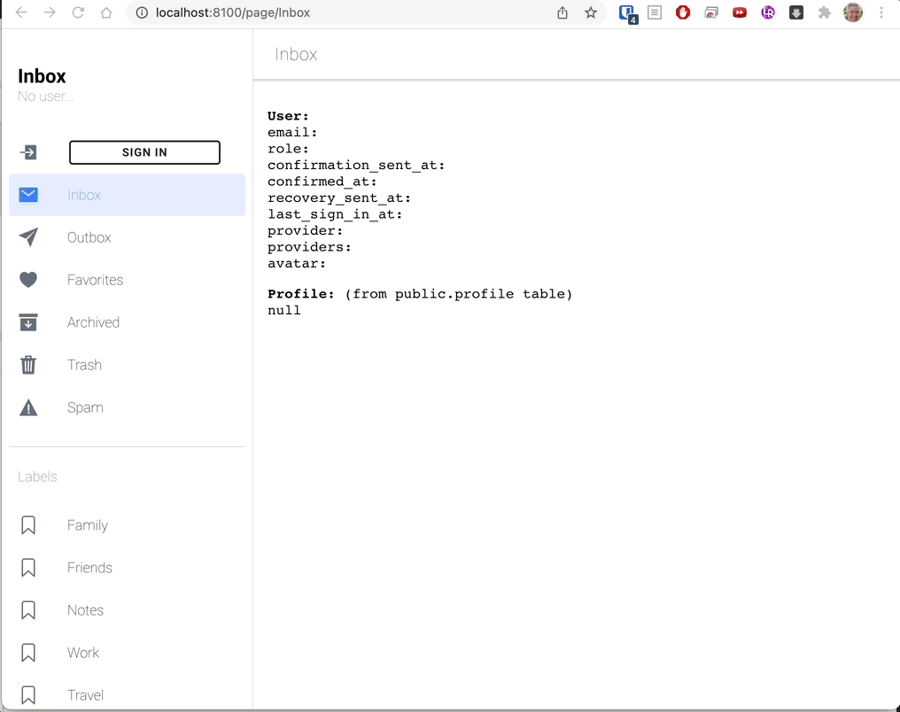

# ionic-react-supabase-login
A modal login component for Ionic React Framework and Supabase Authentication.

Add **TWO LINES** of code to your app and get complete authentication functionality!  If you want password reset functionality as well, make that **THREE LINES**.

(The lines:)
```jsx
import { Login, ResetPassword } from 
'ionic-react-supabase-login';
<Login SUPABASE_URL="url_here" SUPABASE_KEY="key_here" />
<ResetPassword SUPABASE_URL="url_here" SUPABASE_KEY="key_here" />
```

## Demos

#### Sign in with email/password or Oauth Provider



#### Password-less sign in (magic link)


#### Reset Password


## Features
- Register with email / password
- Login with email / password
- Password-less (magic link) login
- Request password reset email
- Process incoming password reset email
- Login with third party Oauth providers
    - supported providers: apple, bitbucket, discord, facebook, github, gitlab, google, twitch, twitter, slack, spotify, notion, zoom, azure, linkedin
    - providers each have a logo button
- Log out
- Display email address for logged in user
- Execute a function when user clicks on their own email (typically this would open your profile page)
- Execute a function on successful login and/or logout
- Subscribe to current user and/or current user’s profile (accessed through useState)

## Quick Start
1. Create a project at [https://supabase.com](https://supabase.com), save your `SUPABASE_URL` and `SUPABASE_KEY` (anonymous key)
2. Create or open an [Ionic React](https://ionicframework.com) Project (use the sidemenu template)
3. Add the component to your project: `npm i ionic-react-supabase-login`
4. Open `Menu.tsx`
5. Import the component on the page: `import { Login, ResetPassword } from 'ionic-react-supabase-login';`
6. In the render section, add:
```jsx
    <Login 
        SUPABASE_URL="https://xxxxxxxxxxxxx.supabase.co"
        SUPABASE_KEY="zzzzzzzzzzzzzzzzzzzzzzzzzzz" />
    <ResetPassword 
        SUPABASE_URL="https://xxxxxxxxxxxxx.supabase.co"
        SUPABASE_KEY="zzzzzzzzzzzzzzzzzzzzzzzzzzz" />
```
Notes:
- The `<Login />` component here is the minimal setup, shown above with the only 2 requirements: your `Supabase URL` and `Anonymous Key`.  That's all you need to allow your users to log in.
- The `<Login />` component renders as a Login button if the user is not logged in.  If the user IS logged in, it renders with the email address of the currently logged-in user and a log out button.
- The `<ResetPassword />` component above is optional, and never shows up in the UI unless the user enters your app from a password reset email link.  If a reset token is found in the URL of the current page, then after 2 seconds, the `ResetPassword` modal component will pop up and request a new password.  At this point, your user is already logged in, because the Reset Password Email link automatically logs the user in by default.

### Login Component
```jsx
    <Login 
        SUPABASE_URL="https://project_ref.supabase.co"
        SUPABASE_KEY="my_supabase_anon_key"
        // everything below is optional
        providers={['google', 'facebook', 'twitter']} // Oauth providers
        backdropDismiss={false} // dismiss when user taps background?
        profileFunction={() => {}} // execute when user taps on user name (go to profile)
        onSignIn={() => {}} // execute on successful signin
        onSignOut={() => {}} // execute on successful signout
        setUser={setUser} // execute useState function on user state change
        profileTable="profile" // set table name for public profile table (i.e. "profile")
        profileKey="key" // set key field name for public profile table (i.e. "id")
    />
```
#### Required Parameters
`SUPABASE_URL` the API URL from your Supabase project (you'll find this in the Supabase dashboard under Settings / API / Configuration: URL)

`SUPABASE_KEY` the ANON KEY from your Supabase project (you'll find this in the Supabase dashboard under Settings / API / Project API keys: anon public)
#### Optional Parameters
`providers` pass an array of strings containing any combination of the following available providers: `apple, bitbucket, discord, facebook, github, gitlab, google, twitch, twitter, slack, spotify, notion, zoom, azure, linkedin`

`backdropDismiss` pass a boolean, true if you want the user to be able to dismiss the modal by tapping on the background

`profileFunction` pass a function that gets executed when the user taps on their email address button when logged in (typically this would take the user to a profile page where they can modify their own profile)

`onSignIn` pass a function that gets executed when a user signs in (useful to redirect a specific page after login)

`onSignOut` pass a function that gets executed when a user signs out (useful to redirect a specific page after logout)

`setUser` pass a `useState` function to be executed when the current user changes

`profileTable` pass a string which is the name of a public table where user profiles are stored - this is required if you want to automatically load a user profile when the current user logs on

`profileKey` pass a string which is the name of the field in the `profileTable` that contains the user id key - this is required if you want to automatically load a user profile when the current user logs on

### Reset Password Component
By default, the `Reset Password` component doesn't render anything.  If, however, the user enters your app by clicking on a `Reset Password Email Link`, a token will appear in the app URL, and the `Reset Password` component will sense this, and pop up a modal after 2 seconds asking for a new password.
```jsx
    <ResetPassword 
    SUPABASE_URL={keys.SUPABASE_URL}
    SUPABASE_KEY={keys.SUPABASE_KEY} />
```
### Subscribe to User and Profile
You can subscribe to state changes for the current user and optionally for the user's profile.  Just pass a `useState` function to be called when the user or profile changes:
```jsx
  const [ user, setUser ] = useState<any>(null);
  const [ profile, setProfile ] = useState<any>(null);
  useEffect(() => {
    const userSubscription = SupabaseAuthService.subscribeUser(setUser);
    const profileSubscription = SupabaseAuthService.subscribeProfile(setProfile);
    return () => {
        SupabaseAuthService.unsubscribeUser(userSubscription);
        SupabaseAuthService.unsubscribeProfile(profileSubscription);
    }
  },[])
```

